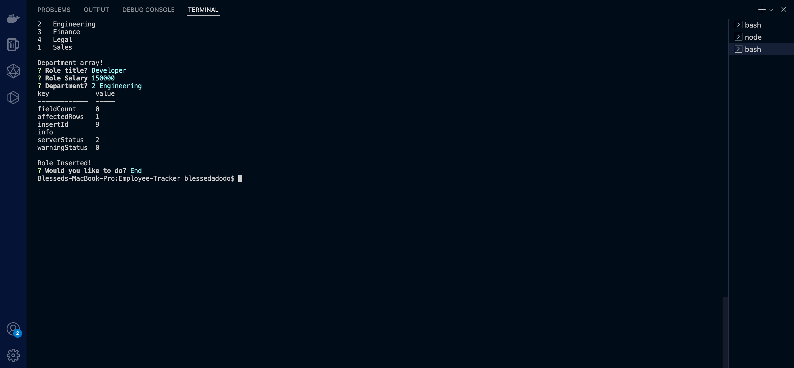

# Employee-Tracker

## License:

license MIT

## Description:

This application was created to generate a high-quality, professional Employee Taker base on a series of questions a user selects. This application use mySql in their local machine.

## Table of Contents:

1. Installation
2. Usage
3. Test

## Installation Instructions:
The user should clone the repository from GitHub and download Node.js. This application also requires to npm install node_modules, package-lock.json, and npm install MySql

## Usage Information:

Use inquirer from your command line to answer questions and use npm start to run the table and see the employees data information. 

## Walkthrough Video:

https://kapwi.ng/w/WT3a9uaKVa

## Test ScreenShot:

